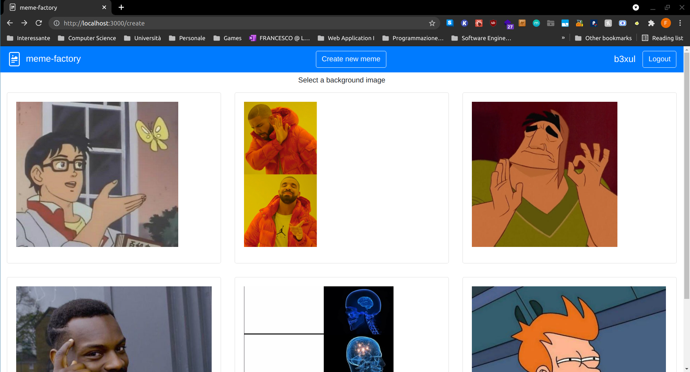
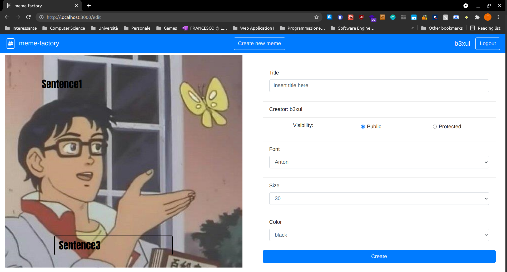

# Exam #2: "Meme generator"
## Student: s290158 SATTOLO FRANCESCO 

## React Client Application Routes

- Route `/`: Contains a list of MemeCards with the main informations about the meme (title, author, visibility, meme "thumbnail"). If the user is logged in, protected memes are also displayed, with buttons to copy/delete each one (can only delete its own).
- Route `/memes/:memeId`: It is typically reached by clicking on one of the cards, which act as a Link that also passes the informations about the meme which was clicked. No additional server requests are performed to display its content. It can also be reached directly from the url bar. It contains all the informations about the meme, and buttons if the user is logged in.
- Route `/create`: It is reached by clicking the Create new meme button. It displays all the background images that the user can choose from, for creating the meme. When hovering over them, each image will display the location of the text areas where the user will be able to write. By clicking on one image that information is passed to the `/edit` route.
- Route `/edit`: Can be reached from the `/create` Route, or by clicking on the Copy button. In this case the fields will be filled by the values of the copied meme. If copying a protected user from another user the "public" checkbox will be disabled. This page contains all the forms needed to create the meme, with the text areas directly on the image.
- Route `/NotExistingRoute` : Whichever route is not covered by the application will display a "404 page not found" page.

## API Server

### Creator management
#### Login

* HTTP method: `POST`  URL: `/api/sessions`
* Description: authenticate the creator who is trying to login
* Request body: credentials of the creator who is trying to login

``` JSON
{
  "username": "John",
  "password": "867AWkAVpmshDFj&"
}
```

* Response: `200 OK` (success)
* Response body: authenticated user

``` JSON
{
  "creatorId": 1,
  "username": "John",
  "email": "john.doe@polito.it"
}
```
* Error responses:  `500 Internal Server Error` (generic error), `401 Unauthorized User` (login failed)
* Error body: 
``` JSON
{
  "error": "Wrong username or password"
}
{
  "message": "Missing credentials"
}
```


#### check whether the creator is logged in or not

* HTTP method: `GET`  URL: `/api/sessions/current`
* Description: check if current user is logged in and get her data
* Request body: _None_
* Response: `200 OK` (success)

* Response body: authenticated user

``` JSON
{
  "creatorId": 1,
  "username": "John",
  "email": "john.doe@polito.it"
}
```

* Error responses:  `500 Internal Server Error` (generic error), `401 Unauthorized User` (user is not logged in)
* Error body:
``` JSON
{
  "error": "Only authenticated users can see create, copy, delete and see protected memes!"
}
```

#### Logout

* HTTP method: `DELETE`  URL: `/api/sessions/current`
* Description: logout current user
* Request body: _None_
* Response: `200 OK` (success)

* Response body: _None_

* Error responses:  `500 Internal Server Error` (generic error), `401 Unauthorized User` (user is not logged in)
* Error body:

``` JSON
{
  "error": "Only authenticated users can create, copy and delete memes!"
}
```
### Background images management
#### Get all background images
* HTTP method: `GET`  URL: `/api/backgroundImages`
* Description: Get the full list of backgroundImages
* Request body: _None_
* Response: `200 OK` (success)
* Response body: Array of objects, each describing one backgroundImage:

``` JSON
[  {
    "imageId": 1,
    "path": "/background_images/Is-This-A-Pigeon.jpg",
    "numberOfAreas": 3,
    "top1": 60,
    "left1": 100,
    "width1": 360,
    "height1": 120,
    "top2": 230,
    "left2": 430,
    "width2": 260,
    "height2": 60,
    "top3": 550,
    "left3": 150,
    "width3": 360,
    "height3": 60
  },
  {
    "imageId": 2,
    "path": "/background_images/Drake-Hotline-Bling.jpg",
    "numberOfAreas": 2,
    "top1": 0,
    "left1": 335,
    "width1": 300,
    "height1": 320,
    "top2": 320,
    "left2": 335,
    "width2": 300,
    "height2": 315,
    "top3": null,
    "left3": null,
    "width3": null,
    "height3": null
  }]
```

* Error responses:  `500 Internal Server Error` (generic error)

### Meme management
#### Get all memes

* HTTP method: `GET`  URL: `/api/memes`
* Description: Get the full list of memes (public and private)
* Request body: _None_
* Response: `200 OK` (success)
* Response body: Array of objects, each describing one meme:

``` JSON
[  {
    "memeId": 2,
    "imageId": 1,
    "creatorId": 1,
    "creatorUsername": "John",
    "title": "Programmer Humor",
    "isProtected": false,
    "fontFamily": "monospace",
    "fontSize": 28,
    "color": "white",
    "sentence1": "programmer",
    "sentence2": "if statement",
    "sentence3": "is this AI?"
  },
  {
    "memeId": 3,
    "imageId": 2,
    "creatorId": 1,
    "creatorUsername": "John",
    "title": "This project",
    "isProtected": true,
    "fontFamily": "Arial",
    "fontSize": 40,
    "color": "black",
    "sentence1": "Do the bare minimum requirements",
    "sentence2": "Add 300 customized styles to make it \"just right\"",
    "sentence3": null
  }]
```

* Error responses:  `500 Internal Server Error` (generic error), `401 Unauthorized User` (user is not logged in)
* Error body:

``` JSON
{
  "error": "Only authenticated users can create, copy and delete memes!"
}
```

#### Get public memes

* HTTP method: `GET`  URL: `/api/memes/public`
* Description: Get the list of the public memes
* Request body: _None_
* Response: `200 OK` (success)
* Response body: Array of objects, each describing one public meme:

``` JSON
[  {
    "memeId": 2,
    "imageId": 1,
    "creatorId": 1,
    "creatorUsername": "John",
    "title": "Programmer Humor",
    "isProtected": false,
    "fontFamily": "monospace",
    "fontSize": 28,
    "color": "white",
    "sentence1": "programmer",
    "sentence2": "if statement",
    "sentence3": "is this AI?"
  },
  {
    "memeId": 4,
    "imageId": 6,
    "creatorId": 2,
    "creatorUsername": "b3xul",
    "title": "Hot laptop",
    "isProtected": false,
    "fontFamily": "Comic Neue",
    "fontSize": 21,
    "color": "white",
    "sentence1": "NOT SURE IF THIS SUMMER IS ESPECIALLY HOT",
    "sentence2": "OR IT IS JUST MY LAPTOP WITH 45 CHROME TABS OPEN",
    "sentence3": null
  }]
```

* Error responses:  `500 Internal Server Error` (generic error)

### Add a new meme

* HTTP method: `POST`  URL: `/api/memes`
* Description: Add a new meme
* Request body: all meme properties beside memeId, which will be computed by the server, plus 2 other properties to let the server verify whether the request is valid or not (originalCreatorId, originalIsProtected)

``` JSON
{
  "imageId":2,
  "title":"This project",
  "isProtected":true,
  "fontFamily":"Arial",
  "fontSize":40,
  "color":"black",
  "sentences":["Do the bare minimum requirements",
  "Add 300 customized styles to make it \"just right\"",
  null],
  "originalCreatorId":1,
  "originalIsProtected":true
}
```

* Response: `200 OK` (success)
* Response body: the object as represented in the database

* Error responses: `401 Unauthorized User` (user is not logged in), `422 Unprocessable Entity` (depending on which values do not satisfy validators), `503 Service Unavailable` (database error like foreign key constraint error)

* Error body:

``` JSON
{
  "error": "Only authenticated users can create, copy and delete memes!"
}
{
  "error": "title: Invalid value, title: Invalid value, isProtected: Invalid value, fontFamily: Invalid value, fontSize: Invalid value, color: Invalid value, originalCreatorId: Invalid value, originalIsProtected: Invalid value, At least one text area must be filled and sentence length can't exceed 300 characters!"
}
```

### Delete an existing meme

* HTTP method: `DELETE`  URL: `/api/memes/:memeId`
* Description: Delete an existing meme of the logged user
* Request body: _None_

* Response: `200 OK` (success)
* Response body: an empty object

* Error responses:  `500 Internal Server Error` (generic error)

```JSON
{
  "error": "Only authenticated users can create, copy and delete memes!"
}
{
  "error": "Couldn't delete meme: not found."
}
```

## Database Tables

- Table `Creator` - contains

| creatorId | username | email | hashedPassword |
| --------- | -------- | ----- | -------------- |

- Table `BackgroundImage` - contains

| imageId | path | numberOfAreas | top1 | left1 | width1 | height1 | top2 | left2 | width2 | height2 | top3 | left3 | width3 | height3 |
| ------- | ---- | ------------- | ---- | ----- | ------ | ------- | ---- | ----- | ------ | ------- | ---- | ----- | ------ | ------- |

I decided not to make another table with only the text areas information to keep things simple, since I thought that it was not so common for 2 background images to share the same exact text areas positions and size. Empty fields will contain null.

- Table `Meme` - contains

| memeId | imageId | creatorId | username | title | isProtected | fontFamily | fontSize | color | sentence1 | sentence2 | sentence3 |
| ------ | ------- | --------- | -------- | ----- | ----------- | ---------- | -------- | ----- | --------- | --------- | --------- |

If a meme has a background image with 2 text Areas, sentence3 will be null, while if the user decides to leave one text area empty, the corresponding sentence will be ''

## Main React Components

- `Navigation` is present in all the routes and let the user logIn and logOut from the system. If the user is logged in, it also contains the button to create a new meme.
- `InteractiveToast` can appear in any Route and may contain errors, success messages, or a button to confirm the removal of a meme.
- List of `BackgroundCard`s is contained in `App` for simplicity. Each one displays the background image to choose from, inside a clickable card.
- List of `MemeCard`s is contained in `App` for simplicity. Each one displays the meme which could be selected, copied or deleted. Height of the meme is fixed, half of the one in memeDetails.
- `MemeDetails` displays all the information about the meme, which could be copied or deleted. Height is fixed.
- `MemeEdit` contains all forms that needs to be filled to create the meme and a button to create it.

(only _main_ components, minor ones may be skipped)

## Screenshot

- Create

- Edit


## Users Credentials

| username | password                  |
| -------- | ------------------------- |
| John     | MNM4H3seGTtiETx           |
| b3xul    | This is my s3cur3 pwd!1!% |
| Ariunz   | gattoPazzo!1%%            |

## Created memes

- John created memeId 2,3,10 (copied from memeId 5)
- b3xul created memeId 4,5 (copied from memeId 3),6
- Ariunz created memeId 7,8 (copied from memeId 1),9 
